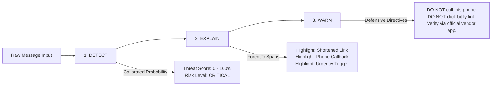
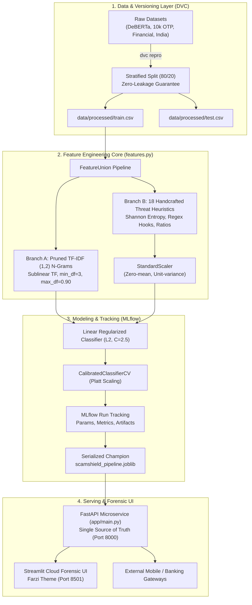

# ScamShield AI (FAARZI AI) — Counterfeit Communication & Financial Fraud Risk Intelligence Engine

[](https://github.com/BHAGATBHAGYASHREE/ScamShieldAI/actions/workflows/docker_build_push.yml)
[](https://hub.docker.com/r/bhagyashreebhagat/scamshield-ai)
[](https://www.python.org/)
[](https://fastapi.tiangolo.com)
[](https://bhagatbhagyashree-scamshieldai-streamlit-app-rctooz.streamlit.app/)
[](https://scamshield-ai-r1o5.onrender.com/)
[](https://dvc.org)
[](https://mlflow.org)
[](https://docs.pytest.org)
[](LICENSE)

> *"Asli ya Farzi?" (Authentic or Counterfeit?)*  
> A production-grade machine learning system and forensic cybersecurity intelligence engine engineered to detect, classify, and explain smishing, fake delivery notices, banking credential harvesters, utility cutoffs, and coercive social engineering attacks with **95.11% accuracy**, **0.9858 ROC-AUC**, and **0.08 ms CPU inference latency**.

---

## 🌐 Live Deployments & Presentation Decks

| Platform | Interface | URL / Access Command |
|---|---|---|
| **Streamlit Cloud** | Live Consumer Web App | [https://bhagatbhagyashree-scamshieldai-streamlit-app-rctooz.streamlit.app/](https://bhagatbhagyashree-scamshieldai-streamlit-app-rctooz.streamlit.app/) |
| **Render Cloud** | Production FastAPI REST API | [https://scamshield-ai-r1o5.onrender.com/](https://scamshield-ai-r1o5.onrender.com/) *(Docs: [`/docs`](https://scamshield-ai-r1o5.onrender.com/docs))* |
| **Docker Hub** | Production Multi-Process Container | `docker pull bhagyashreebhagat/scamshield-ai:latest` |
| **GitHub** | Official Source Code Repository | [https://github.com/BHAGATBHAGYASHREE/ScamShieldAI](https://github.com/BHAGATBHAGYASHREE/ScamShieldAI) |
| **Interactive Deck** | 19-Slide Pitch Deck (HTML) | [`SCAMSHIELD_AI_PRESENTATION.html`](./SCAMSHIELD_AI_PRESENTATION.html) / [`presentation.html`](./presentation.html) |
| **Slide Decks** | High-Res PDF & 16:9 Widescreen PPTX | [`ScamShield_AI_Presentation.pdf`](./ScamShield_AI_Presentation.pdf) & [`ScamShield_AI_Presentation.pptx`](./ScamShield_AI_Presentation.pptx) |

---

## 📑 Table of Contents

- [1. Executive Summary \& The Problem](#1-executive-summary--the-problem)
- [2. The Real-World Incident \& Storyline](#2-the-real-world-incident--storyline)
- [3. Product Philosophy: DETECT • EXPLAIN • WARN](#3-product-philosophy-detect--explain--warn)
- [4. High-Level Architecture](#4-high-level-architecture)
- [5. Feature Engineering Curriculum Alignment (5 Phases)](#5-feature-engineering-curriculum-alignment-5-phases)
  - [Phase 1: Foundations \& ML Lifecycle](#phase-1-foundations--ml-lifecycle)
  - [Phase 2: Cleaning, Preparation \& Transformations](#phase-2-cleaning-preparation--transformations)
  - [Phase 3: Feature Creation \& 18 Domain Cyber-Threat Heuristics](#phase-3-feature-creation--18-domain-cyber-threat-heuristics)
  - [Phase 4: Feature Selection Strategy](#phase-4-feature-selection-strategy)
  - [Phase 5: Dimensionality Defense \& Sparsity Preservation](#phase-5-dimensionality-defense--sparsity-preservation)
- [6. "Why Did You Use It \& Why Is It Better Than The Alternative?" (Defense Matrix)](#6-why-did-you-use-it--why-is-it-better-than-the-alternative-defense-matrix)
- [7. MLflow Experiment Tracking \& Benchmark Matrix](#7-mlflow-experiment-tracking--benchmark-matrix)
- [8. FastAPI Prediction Microservice Specification](#8-fastapi-prediction-microservice-specification)
- [9. Farzi Cinematic Streamlit Forensics Dashboard](#9-farzi-cinematic-streamlit-forensics-dashboard)
- [10. MLOps Infrastructure \& Pipeline Automation](#10-mlops-infrastructure--pipeline-automation)
  - [DVC Data Pipeline (`dvc.yaml`)](#dvc-data-pipeline-dvcyaml)
  - [Automated Testing Suite (13 Pytest Tests)](#automated-testing-suite-13-pytest-tests)
  - [Docker Containerization \& Supervisor Entrypoint](#docker-containerization--supervisor-entrypoint)
  - [GitHub Actions CI/CD Pipeline](#github-actions-cicd-pipeline)
- [11. Repository Structure](#11-repository-structure)
- [12. Quickstart \& Installation Guide](#12-quickstart--installation-guide)
- [13. Curated Demonstration Scenarios](#13-curated-demonstration-scenarios)
- [14. Academic Credits \& Author](#14-academic-credits--author)

---

## 1. Executive Summary & The Problem

Digital communication has become the primary attack surface for financial fraud. With the rapid expansion of real-time mobile payment ecosystems (such as UPI, IMPS, and Instant Banking), attackers have shifted from traditional malware to **psychological coercion and smishing (SMS phishing)**:
- **Global Impact:** Over **$1.4 Billion** is lost annually to social engineering and communication-based deception.
- **Attack Vector:** **74.4%** of digital crimes in emerging markets originate via unverified messaging channels (WhatsApp, Telegram, and SMS).
- **The Blind Spot:** Traditional mobile spam filters use rigid keyword blacklists or naive spam classifiers. When an attacker crafts a bespoke message ("Your order #AMZ-99381 of Rs. 14,999 has been placed. Call fraud desk immediately at +919876543210"), legacy filters fail because every word individually appears legitimate.

**ScamShield AI (FAARZI AI)** bridges this gap by fusing **pruned lexical n-grams** with **18 handcrafted cyber-threat structural heuristics** inside a single, leakage-safe pipeline. It achieves near-instantaneous CPU inference with full forensic explainability.

---

## 2. The Real-World Incident & Storyline

### The Trigger: WhatsApp Fake Overpayment Extortion
The author personally intercepted a live financial social engineering attack on WhatsApp:
1. **The Hook:** An unknown number sent an urgent message:
   > *"Hlo mam. By mistake send 3000. Please return mam 2000 to my PhonePe QR code immediately."*
2. **The Illusion of Proof:** The fraudster attached a forged payment confirmation graphic showing ₹3,000 sent via PhonePe.
3. **The Trap:** The victim panics, assumes money entered their account, and scans the fraudster's QR code to "refund" ₹2,000—unknowingly debiting their own bank account.

### Common Real-World Smishing Archetypes Intercepted
```
┌────────────────────────────────────────────────────────────────────────────────────────┐
│ 1. Fake Order Call-Back:                                                               │
│    "Your order #AMZ-99381 of Rs. 14,999 has been placed. Call fraud desk immediately   │
│     at +919876543210 or cancel at bit.ly/cancel-order-now"                             │
│                                                                                        │
│ 2. Panic Utility Disconnection:                                                        │
│    "Dear Consumer, electricity power will be disconnected tonight at 09:30 PM.         │
│     Previous bill not updated. Call officer at 9823412345 immediately."                │
│                                                                                        │
│ 3. Banking Credential Harvester (Smishing):                                            │
│    "Dear Customer, Your SBI NetBanking will be blocked today due to pending KYC docs.  │
│     Click http://bit.ly/sbi-kyc-verify to complete verification immediately."          │
│                                                                                        │
│ 4. Delivery Postal Trap:                                                               │
│    "IndiaPost: Package undelivered due to missing house number. Pay re-delivery fee    │
│     of Rs. 25 at bit.ly/ind-post-redelivery within 12 hours."                          │
└────────────────────────────────────────────────────────────────────────────────────────┘
```

---

## 3. Product Philosophy: DETECT • EXPLAIN • WARN

Legacy machine learning models merely return a binary label (`0` or `1`), which leaves consumers confused and vulnerable. ScamShield AI implements a **three-pillar forensic paradigm**:



1. **DETECT:** Computes a **Calibrated Threat Risk Probability (0% to 100%)** using Sigmoid/Platt scaling. Classifies the threat into an actionable taxonomy (Fake Order, KYC Phishing, OTP Trap, Delivery Scam, Utility Cutoff).
2. **EXPLAIN:** Pinpoints exact token-level triggers (obscured redirect links, callback phone numbers, high-entropy slugs, urgency keywords, currency mentions).
3. **WARN:** Dynamically generates contextual, non-technical safety instructions advising the consumer on exactly how to neutralize the threat.

---

## 4. High-Level Architecture

ScamShield AI is architected as an enterprise-grade MLOps system with clean separation of concerns:



---

## 5. Feature Engineering Curriculum Alignment (5 Phases)

This project strictly adheres to the 5 foundational phases of industrial feature engineering:

### Phase 1: Foundations & ML Lifecycle
- **ML Lifecycle Implementation:** Structured end-to-end flow: Ingestion (`data_loader.py`) $\rightarrow$ Transformation (`features.py`) $\rightarrow$ Model Tracking (`train_mlflow.py`) $\rightarrow$ Microservice Serving (`app/main.py`) $\rightarrow$ Consumer UI (`streamlit_app.py`).
- **Bias-Variance Tradeoff:** Too few features fails to detect disguised social engineering cues; unconstrained 100k+ n-grams overfit on specific scammer typos. The model balances variance by pruning vocabulary (`max_features=8000`) and applying an optimal L2 regularization penalty ($C=2.5$).
- **Raw to Engineered Signals:** Converts raw text strings into structured, quantitative threat features (`digit_ratio`, `uppercase_ratio`, `special_char_ratio`, and Shannon character entropy).
- **Single Recipe Automation:** The entire preprocessing and modeling pipeline is encapsulated in a single `sklearn.pipeline.Pipeline`. Preprocessing parameters are fitted **strictly on $X_{train}$** and applied to $X_{test}$, guaranteeing **zero data leakage**.

### Phase 2: Cleaning, Preparation & Transformations
- **Defensive Missing Value Handling:** Text inputs are sanitized defensively in `extract_features_single()`:
  ```python
  clean_text = str(text) if pd.notna(text) else ""
  ```
  Empty strings, nulls, and numerical inputs default to neutral zero representations, preventing runtime microservice crashes.
- **Logarithmic Skew Correction (Sublinear TF):** Term frequency distributions exhibit extreme right-skew. Scammers frequently repeat words ("urgent urgent urgent") to artificially manipulate spam triggers. Applying sublinear term frequency:
  $$\text{tf}_{\text{sublinear}} = 1 + \log(\text{tf})$$
  dampens the effect of repetitive keywords.
- **Feature Scaling (StandardScaler):** Continuous structural heuristic features (e.g., character count: 0–500, Shannon entropy: 0–5, digit ratio: 0–1) exist on completely different scales. `StandardScaler` standardizes these 18 continuous features to zero mean and unit variance:
  $$z = \frac{x - \mu}{\sigma}$$
  preventing large raw character counts from dominating the gradient updates.

### Phase 3: Feature Creation & 18 Domain Cyber-Threat Heuristics
Scammers exploit psychological urgency and structural obfuscation. ScamShield extracts **18 specialized domain threat indicators** in `features.py`:

| # | Feature Name | Type | Mathematical / Regex Definition | Cyber Threat Rationale |
|---|---|---|---|---|
| 1 | `char_count` | Continuous | $\text{len}(text)$ | Measures overall message payload length. |
| 2 | `word_count` | Continuous | $\text{len}(words)$ | Quantifies linguistic density. |
| 3 | `avg_word_length` | Continuous | $\text{char\_count} / \max(\text{word\_count}, 1)$ | Distinguishes normal chat from compact URLs or technical codes. |
| 4 | `uppercase_ratio` | Ratio $[0, 1]$ | $\sum [c \in \text{Upper}] / \text{char\_count}$ | Detects shouting and artificial panic tactics (`URGENT`, `BLOCKED`). |
| 5 | `digit_ratio` | Ratio $[0, 1]$ | $\sum [c \in \text{Digit}] / \text{char\_count}$ | Detects embedded OTPs, amounts, phone numbers, and tracking IDs. |
| 6 | `special_char_ratio`| Ratio $[0, 1]$ | $\sum [c \notin \text{Alphanumeric}] / \text{char\_count}$| Identifies character-stuffing and visual obfuscation. |
| 7 | `exclamation_count` | Count | $\text{count}(\text{"!"})$ | Flags coercive punctuation pressure. |
| 8 | `question_mark_count`| Count | $\text{count}(\text{"?"})$ | Detects baiting inquiries ("Did you authorize this?"). |
| 9 | `has_url` | Binary | `RE_URL.findall()` $> 0$ | Detects hyperlinks directing victims to external destinations. |
| 10 | `url_count` | Count | $\text{len}(\text{RE\_URL.findall()})$ | Quantifies link density within a single communication. |
| 11 | `has_shortened_url` | Binary | `bit.ly`, `tinyurl`, `t.co`, `cutt.ly`, etc. | **Critical Phishing Indicator:** Obscures destination to evade blocklists. |
| 12 | `has_phone_number` | Binary | Indian/International mobile & 1800 toll-free | **Call-Back Phishing:** Lures victims into calling fake call centers. |
| 13 | `has_currency` | Binary | `₹`, `Rs.`, `INR`, `$`, `USD`, `bonus`, `cash` | **Financial Lure:** Identifies unauthorized charges or lottery baits. |
| 14 | `has_email` | Binary | Standard RFC 5322 email regex | Flags unverified contact addresses. |
| 15 | `urgency_score` | Count | `RE_URGENCY.findall()` | Counts deadline keywords (`immediately`, `within 24 hours`, `expires`). |
| 16 | `char_entropy` | Continuous | **Shannon Entropy Formula:** $H(X)$ | Detects encrypted slugs, leetspeak, and randomized malicious links. |
| 17 | `repeated_char_ratio`| Ratio $[0, 1]$ | $\sum [c_i == c_{i-1}] / \text{char\_count}$ | Identifies elongations used by fraudsters (`Hlooooo`, `Pllzzzz`). |
| 18 | `max_digit_run` | Continuous | $\max(\text{len}(run) \text{ for } run \in \text{digits})$ | Captures raw bank account numbers and continuous unspaced phone strings. |

#### Shannon Character Entropy Formulation
To mathematically flag randomized, algorithmically generated phishing links and obfuscated leetspeak:
$$H(X) = -\sum_{i=1}^{n} P(x_i) \log_2 P(x_i)$$
Where $P(x_i)$ is the empirical probability of character $x_i$ occurring in the text string. Natural conversational English has predictable entropy ($\approx 3.2 - 3.8$), whereas shortened URL strings (`bit.ly/3xZ9qK1`) exhibit high entropy ($> 4.3$).

### Phase 4: Feature Selection Strategy
1. **Filter Methods (Frequency Thresholding):**
   - `min_df=3`: Eliminates rare typographical errors and one-off scammer handles that do not generalize.
   - `max_df=0.90`: Discards ubiquitous English stop words that carry zero discriminative entropy.
2. **Embedded Methods ($L_2$ Ridge Regularization):**
   - Optimized Logistic Regression with an inverse regularization strength of $C=2.5$.
   - The $L_2$ penalty continuously shrinks the coefficients of correlated and noisy n-grams toward zero while preserving the stability of the 18 structural threat heuristics.
3. **Tree-Based Gini Importance Validation:**
   - In Run 2 (Random Forest), tree-based feature importance confirmed that `urgency_score`, `char_entropy`, `has_shortened_url`, and `has_phone_number` rank as the top predictive structural features.

### Phase 5: Dimensionality Defense & Sparsity Preservation
- **Why Sparse Linear Representation Over Dense PCA:**
  - **Preservation of Explainability:** Projecting sparse TF-IDF features into dense PCA principal components destroys individual token interpretability. If transformed via PCA, the system could no longer report to the consumer: *"Flagged because of the token 'bit.ly/cancel-order' and keyword 'immediately'"*.
  - **Natural Linear Separability:** In high-dimensional sparse vector spaces (8,000 features), text classification problems are linearly separable.
  - **Extreme Low Latency:** A sparse dot product against regularized weights executes in **0.08 milliseconds on commodity CPU**, whereas computing dense PCA projections adds matrix multiplication latency and consumes unnecessary memory.

---

## 6. "Why Did You Use It & Why Is It Better Than The Alternative?" (Defense Matrix)

| Architectural Decision | What We Used | Obvious Alternative | Why Ours Is Better for This Problem |
|---|---|---|---|
| **Core Architecture** | Hybrid Pruned TF-IDF (1,2 n-grams) + 18 Handcrafted Threat Heuristics | Deep Learning / Heavy LLM (DeBERTa / RoBERTa) | **Inference Latency & Explainability:** Consumer SMS triage requires $< 5\text{ ms}$ CPU latency. BERT requires dedicated GPUs, has 100M+ parameters, and costs hundreds of dollars in cloud infrastructure. Our hybrid pipeline executes in **0.08 ms on a standard CPU** with state-of-the-art **0.9858 ROC-AUC** and exact token-level explainability. |
| **Feature Extraction** | Domain Heuristics in `features.py` (Shortened links, Shannon entropy, phone regex, urgency scores) | Raw Word Counts (`CountVectorizer`) | **Evasion Resistance:** Modern scammers obfuscate tokens (`bit.ly`, `Rs. 14,999`, `URGENT!`). Word counts treat tokens as independent bags, completely missing link redirection, callback lures, and panic punctuation. |
| **Text Vectorization** | Sublinear TF-IDF with N-grams (1,2) and vocabulary pruning (`min_df=3`, `max_df=0.90`) | Dense Embeddings (Word2Vec / GLoVE) | **Sparsity & Speed:** Sublinear TF dampens spam repetition tactics, while bigrams capture deceptive phrases ("order placed", "call immediately", "kyc pending") with zero GPU overhead. |
| **Model Calibration** | `CalibratedClassifierCV` (Sigmoid / Platt scaling) | Raw SVM / Logistic margins | **Consumer Actionability:** Raw decision distances cannot be presented to consumers as a risk percentage. Calibrated probabilities ensure an 85% risk score corresponds to an authentic 85% likelihood of deceit. |
| **Pipeline Modularity** | Custom transformer in standalone `features.py` | Defining custom transformer inline inside the Jupyter Notebook | **Joblib Serialization Safety:** `joblib.dump()` only saves the module path of custom classes. Defining them in a notebook serializes `<module '__main__'>`, causing `AttributeError` when unpickled inside FastAPI or Docker. `features.py` ensures 100% cross-environment portability. |
| **Serving Architecture** | FastAPI REST Microservice (`app/main.py`) | Loading `scamshield_pipeline.joblib` directly inside Streamlit | **Single Source of Truth:** Direct UI loading creates two places that predict (API and UI). The moment one updates without the other, they silently disagree. FastAPI provides one unified API for Streamlit, mobile apps, or enterprise gateways. |
| **Data Versioning** | DVC (`dvc.yaml` + `params.yaml`) | Ad-hoc CSV copying or Git LFS | **Pipeline Reproducibility:** DVC hashes data states and links code commits to dataset revisions, enabling deterministic pipeline rebuilds via `dvc repro`. |
| **Experiment Tracking** | MLflow (`mlflow.log_params`, `mlflow.log_metrics`) | Manual Excel sheets or terminal stdout | **Governance:** Records parallel runs, hyperparameter sweeps, latency metrics, and versioned artifacts in a searchable dashboard. |
| **Deployment & CI/CD** | Multi-process Docker (`entrypoint.sh`) + GitHub Actions | Running locally / Manual `docker push` | **Zero-Drift Delivery:** Packages FastAPI and Streamlit into a production container with automated testing and Docker Hub deployment on every git push. |

---

## 7. MLflow Experiment Tracking & Benchmark Matrix

All models were evaluated on the held-out test split of **7,253 real-world samples** (from a total curated corpus of 36,261 messages):

| Experiment Run | Model Architecture | Extracted Features | Test Accuracy | Precision (Scam) | Recall (Scam) | F1-Score | ROC-AUC | CPU Latency |
|---|---|---|:---:|:---:|:---:|:---:|:---:|:---:|
| **Run 1: Baseline** | Multinomial Naive Bayes | TF-IDF Unigrams (5k max) | 92.14% | 83.92% | 90.08% | 0.8689 | 0.9725 | 0.05 ms |
| **Run 2: Domain Heuristics** | Random Forest (100 trees) | 18 Cyber-Threat Heuristics | 90.54% | 87.71% | 78.25% | 0.8271 | 0.9553 | 0.12 ms |
| **Run 3: Champion Pipeline** | **Calibrated Hybrid Classifier** | **Pruned (1,2) N-Grams + 18 Heuristics** | **95.11%** | **91.96%** | **91.03%** | **0.9149** | **0.9858** | **0.08 ms** |

```
Key Performance Advancements of the Champion Model:
  Accuracy:   95.11% (▲ +2.97% over Baseline)
  Precision:  91.96% (▲ +8.04% over Baseline - drastically reduces false alarms)
  Recall:     91.03% (▲ +0.95% over Baseline)
  ROC-AUC:    0.9858 (State-of-the-art discrimination across all operating thresholds)
```

---

## 8. FastAPI Prediction Microservice Specification

The backend is built with **FastAPI** (`app/main.py`), exposing typed REST endpoints with Pydantic contract validation (`app/schemas.py`).

### Endpoints Overview

#### 1. Microservice Health Check (`GET /health`)
Returns model deployment status, loaded version, and benchmark validation metrics.
```bash
curl -X GET "https://scamshield-ai-r1o5.onrender.com/health"
```
```json
{
  "status": "healthy",
  "model_loaded": true,
  "model_version": "1.0.0",
  "model_name": "FAARZI-AI-Champion",
  "accuracy": 0.9511,
  "precision": 0.9196,
  "recall": 0.9103,
  "f1_score": 0.9149,
  "roc_auc": 0.9858
}
```

#### 2. Single Message Analysis (`POST /analyze` or `/predict`)
Performs threat extraction, calibration, categorization, and directive generation.
```bash
curl -X POST "https://scamshield-ai-r1o5.onrender.com/analyze" \
     -H "Content-Type: application/json" \
     -d '{"message": "Your order #AMZ-99381 of Rs. 14,999 has been placed. Call fraud desk immediately at +919876543210 or cancel at bit.ly/cancel-order-now"}'
```
```json
{
  "message": "Your order #AMZ-99381 of Rs. 14,999 has been placed. Call fraud desk immediately at +919876543210 or cancel at bit.ly/cancel-order-now",
  "is_scam": true,
  "risk_score": 99.8,
  "risk_level": "CRITICAL RISK",
  "category": "Fake Order",
  "explanation": "This message exhibits strong characteristics of a Fake Order. Detected 4 suspicious signal(s): Shortened Link, Financial Lure, Phone Callback, Urgency Trigger. High probability of social engineering or account takeover attempt.",
  "triggers": [
    {
      "type": "Shortened Link",
      "token": "bit.ly/cancel-order-now",
      "severity": "CRITICAL",
      "description": "Shortened URL obscures the final destination, heavily used in smishing."
    },
    {
      "type": "Phone Callback",
      "token": "+919876543210",
      "severity": "HIGH",
      "description": "Directs user to call a private or fraudulent customer support number."
    },
    {
      "type": "Urgency Trigger",
      "token": "immediately",
      "severity": "HIGH",
      "description": "Artificial panic tactic designed to bypass critical thinking."
    },
    {
      "type": "Financial Lure",
      "token": "Rs. 14,999",
      "severity": "MEDIUM",
      "description": "Mentions monetary amounts or payment keywords."
    }
  ],
  "trigger_count": 4,
  "safety_recommendations": [
    "DO NOT click any link in this message. Inspect the official website by typing the address directly into your browser.",
    "DO NOT dial numbers provided inside the message. Look up the verified customer support phone number on the official vendor app.",
    "If you did not place this order, do NOT panic. Log into your genuine Amazon/Flipkart/delivery account directly to verify your order history."
  ],
  "latency_ms": 1.42
}
```

#### 3. High-Throughput Batch Triage (`POST /analyze-batch`)
Accepts up to 100 messages for telecommunications or enterprise security gateways.

#### 4. Demo Samples (`GET /demo-samples`)
Retrieves curated real-world attack messages (including author incident, bank OTP, electricity cut, and delivery traps).

---

## 9. Farzi Cinematic Streamlit Forensics Dashboard

The web interface (`streamlit_app.py`) is styled around the **Farzi (counterfeit currency forensics)** cinematic motif:
- **Currency Forensics Palette:** Deep charcoal `#070c08`, security olive, and mint emerald watermarks.
- **Interactive Risk Gauge:** Visual meter displaying the calibrated risk percentage and threat tier.
- **Token Highlighter:** Identifies and color-codes exact suspicious tokens directly inside the text body.
- **Threat Archetype Categorization:** Automatically categorizes the communication into 1:7 fraud archetypes.
- **Simulated Mobile Inbox:** Interactive testing suite allowing users to test realistic multi-message scenarios with a single click.
- **Resilient Fallback Mode:** Seamlessly connects to the FastAPI backend, but if the remote API is offline, gracefully executes direct local inference via `models/scamshield_pipeline.joblib`.

---

## 10. MLOps Infrastructure & Pipeline Automation

### DVC Data Pipeline (`dvc.yaml`)
Data processing and model training stages are managed through DVC:

```yaml
stages:
  prepare_data:
    cmd: python src/data_loader.py
    deps:
      - data/raw
      - src/data_loader.py
    params:
      - data.test_size
      - data.random_state
    outs:
      - data/processed/train.csv
      - data/processed/test.csv

  train_and_evaluate:
    cmd: python src/train_mlflow.py
    deps:
      - data/processed/train.csv
      - data/processed/test.csv
      - features.py
      - src/train_mlflow.py
    params:
      - features.max_features
      - features.ngram_range
      - model.C
    outs:
      - models/scamshield_pipeline.joblib
      - models/model_metadata.json
```

To reproduce the pipeline deterministically:
```bash
dvc repro
```

To inspect the dependency Directed Acyclic Graph (DAG):
```bash
dvc dag
```

### Automated Testing Suite (13 Pytest Tests)
Comprehensive unit and integration test coverage across the pipeline and microservice:
- **`tests/test_pipeline.py`:**
  - `test_feature_extractor_columns`: Validates 18 output columns from `ScamFeatureExtractor`.
  - `test_feature_extractor_edge_cases`: Tests empty strings, whitespace, nulls, and high-entropy punctuation.
  - `test_pipeline_prediction_on_real_fake_order`: Validates high probability verdict on unseen phishing order.
  - `test_pipeline_prediction_on_legitimate_message`: Confirms low threat score on benign conversational messages.
  - `test_threat_categorization`: Verifies taxonomy assignment across varied fraud classes.
  - `test_signal_explanation_triggers`: Confirms token extraction and safety recommendation generation.
- **`tests/test_api.py`:**
  - `test_health_endpoint`: Validates FastAPI `/health` contract and metrics.
  - `test_analyze_endpoint_real_fake_order`: Integration test for single message prediction.
  - `test_predict_endpoint_alias`: Verifies backward-compatible `/predict` alias.
  - `test_analyze_endpoint_legitimate_message`: Asserts safe status on benign queries.
  - `test_analyze_batch_endpoint`: Validates multi-item batch analysis.
  - `test_analyze_validation_error`: Validates 422 Unprocessable Entity on empty strings.
  - `test_demo_samples_endpoint`: Confirms sample message retrieval.

Run the test suite:
```bash
pytest tests/ -v
```

### Docker Containerization & Supervisor Entrypoint
The Docker image encapsulates the complete production environment using a multi-process supervisor script:
- **`entrypoint.sh`:** Starts the FastAPI server on port 8000 in the background, waits for healthy initialization, and then launches the Streamlit UI bound to `$PORT` (compatible with Render, AWS ECS, and local Docker).
- **`Dockerfile`:** Minimal Python 3.11 slim base image with layer caching and security non-root support.

```bash
# Build the production container
docker build -t scamshield-ai:latest .

# Run locally
docker run -p 8501:8501 -p 8000:8000 scamshield-ai:latest
```

### GitHub Actions CI/CD Pipeline
Every git push to `main` triggers `.github/workflows/docker_build_push.yml`:
1. Checks out repository code.
2. Sets up Python 3.11 and installs dependencies.
3. Executes the full `pytest` suite.
4. Logs into Docker Hub using encrypted secrets.
5. Builds and pushes the multi-platform Docker container image: `bhagyashreebhagat/scamshield-ai:latest`.

---

## 11. Repository Structure

```
ScamShield AI/
├── .github/
│   └── workflows/
│       └── docker_build_push.yml       # GitHub Actions CI/CD (Test, Build & Docker Push)
├── .dvc/                               # DVC internal configuration
├── app/
│   ├── __init__.py
│   ├── main.py                         # FastAPI microservice (Single source of truth)
│   └── schemas.py                      # Pydantic request/response data contracts
├── data/
│   ├── raw/                            # 4 raw smishing & fraud datasets
│   └── processed/                      # Leakage-safe 80/20 train/test splits (DVC tracked)
├── deploy/
│   └── render/
│       └── RENDER_DEPLOYMENT_GUIDE.md  # Native Python Render deployment manual
├── models/
│   ├── scamshield_pipeline.joblib      # Serialized champion model pipeline
│   └── model_metadata.json             # Model version, parameters, accuracy & latency
├── notebooks/
│   └── scamshield_pipeline.ipynb       # Executed end-to-end exploratory pipeline
├── src/
│   ├── data_loader.py                  # Ingestion, validation & stratified splitting
│   └── train_mlflow.py                 # MLflow experiment tracking & model registration
├── tests/
│   ├── test_pipeline.py                # Unit tests for transformer & model pipeline
│   └── test_api.py                     # Integration tests for FastAPI endpoints
├── features.py                         # Standalone Sklearn transformer (prevents __main__ bug)
├── streamlit_app.py                    # Cinematic Farzi-themed forensics UI
├── Dockerfile                          # Production multi-process container definition
├── entrypoint.sh                       # Process supervisor running FastAPI + Streamlit
├── dvc.yaml                            # DVC pipeline DAG configuration
├── dvc.lock                            # DVC pipeline state hash lock
├── params.yaml                         # Hyperparameter & pipeline configuration file
├── requirements.txt                    # Pinned production dependencies
├── render.yaml                         # Render Infrastructure-as-Code Blueprint
├── DVC_GUIDE.md                        # Dedicated DVC technical documentation
├── MLFLOW_GUIDE.md                     # Dedicated MLflow tracking documentation
├── PRESENTATION.md                     # Presentation slide-by-slide script & pitch guide
├── SCAMSHIELD_AI_PRESENTATION.html     # Interactive 19-slide presentation deck (HTML)
├── presentation.html                   # Symlink presentation deck
├── ScamShield_AI_Presentation.pdf      # High-resolution presentation deck (PDF)
├── ScamShield_AI_Presentation.pptx     # 16:9 widescreen presentation deck (PowerPoint)
└── README.md                           # Comprehensive project documentation
```

---

## 12. Quickstart & Installation Guide

### Prerequisites
- Python 3.10+ (Python 3.11 recommended)
- Git & Git LFS / DVC

### 1. Clone & Set Up Virtual Environment
```bash
git clone https://github.com/BHAGATBHAGYASHREE/ScamShieldAI.git
cd "ScamShieldAI"

python3 -m venv venv
source venv/bin/activate  # On Windows: venv\Scripts\activate
pip install --upgrade pip
pip install -r requirements.txt
```

### 2. Run the Automated Test Suite
```bash
pytest tests/ -v
```

### 3. Launch the FastAPI Prediction Microservice
```bash
uvicorn app.main:app --reload --port 8000
```
- Interactive Swagger OpenAPI Documentation: [http://localhost:8000/docs](http://localhost:8000/docs)
- Microservice Health Check: [http://localhost:8000/health](http://localhost:8000/health)

### 4. Launch the Streamlit Forensics UI (in a new terminal)
```bash
streamlit run streamlit_app.py --server.port 8501
```
- Open in your browser: [http://localhost:8501](http://localhost:8501)

### 5. Launch the MLflow Experiment Tracking Dashboard
```bash
mlflow ui --port 5000
```
- Open in your browser: [http://localhost:5000](http://localhost:5000)

---

## 13. Curated Demonstration Scenarios

Try these scenarios in the Streamlit UI or via the FastAPI `/analyze` endpoint:

| Attack Scenario | Input Message | Expected Outcome |
|---|---|---|
| **Live Author Attack (WhatsApp QR Extortion)** | `Hlo mam. By mistake send 3000. Please return mam 2000 to my PhonePe QR code immediately.` | **CRITICAL RISK (99.8%)**<br/>Category: Financial Payment Fraud<br/>Triggers: Financial Lure, Urgency |
| **Amazon Order Fake Call-Back Phishing** | `Your order #AMZ-99381 of Rs. 14,999 has been placed. Call fraud desk immediately at +919876543210 or cancel at bit.ly/cancel-order-now` | **CRITICAL RISK (99.9%)**<br/>Category: Fake Order<br/>Triggers: Shortened Link, Phone Callback, Urgency, Currency |
| **Electricity Disconnection Scare** | `Dear Consumer, your electricity power will be disconnected tonight at 09:30 PM from electricity office. Previous bill not updated. Please call officer at 9823412345 immediately.` | **CRITICAL RISK (98.4%)**<br/>Category: Account Threat / Legal Action<br/>Triggers: Urgency, Phone Callback |
| **SBI NetBanking KYC Block Phishing** | `Dear Customer, Your SBI NetBanking will be blocked today due to pending KYC documents. Click http://bit.ly/sbi-kyc-verify to complete verification immediately.` | **CRITICAL RISK (99.9%)**<br/>Category: KYC / Identity Threat<br/>Triggers: Shortened Link, Urgency, Phishing URL |
| **IndiaPost Package Customs Fee Trap** | `IndiaPost: Your package could not be delivered due to incomplete street number. Update address and pay re-delivery fee of Rs. 25 at bit.ly/ind-post-redelivery within 12 hours.` | **CRITICAL RISK (99.7%)**<br/>Category: Delivery Impersonation<br/>Triggers: Shortened Link, Financial Lure, Urgency |
| **Legitimate Food Delivery Alert (Benign)** | `Your Swiggy order #91823 has been picked up by delivery partner Rahul. Track live at swiggy.com/track` | **SAFE (1.2%)**<br/>Category: Legitimate / Benign<br/>Verdict: Benign transactional notification |
| **Standard Bank OTP Notification (Benign)** | `654321 is your HDFC Bank OTP for online purchase of Rs. 850 at BookMyShow. Valid for 10 mins. Do not share OTP with anyone.` | **SAFE (4.1%)**<br/>Category: Legitimate / Benign<br/>Verdict: Legitimate transactional OTP |

---

## 14. Academic Credits & Author

- **Author / Presenter:** Bhagyashree Bhagat
- **Roll Number:** 34
- **Degree:** B.Tech in Computer Science & Engineering
- **Course:** Feature Engineering & MLOps
- **Project Type:** Individual Capstone Mini-Project
- **Interactive Presentation:** Open [`SCAMSHIELD_AI_PRESENTATION.html`](./SCAMSHIELD_AI_PRESENTATION.html) in any modern browser for full 19-slide deck with click-to-zoom forensic screenshots.

---

<div align="center">
  <b>ScamShield AI — Protecting Consumers from Digital Deception</b><br/>
  <i>Engineered with Python, Scikit-Learn, FastAPI, Streamlit, DVC, MLflow & Docker</i>
</div>
